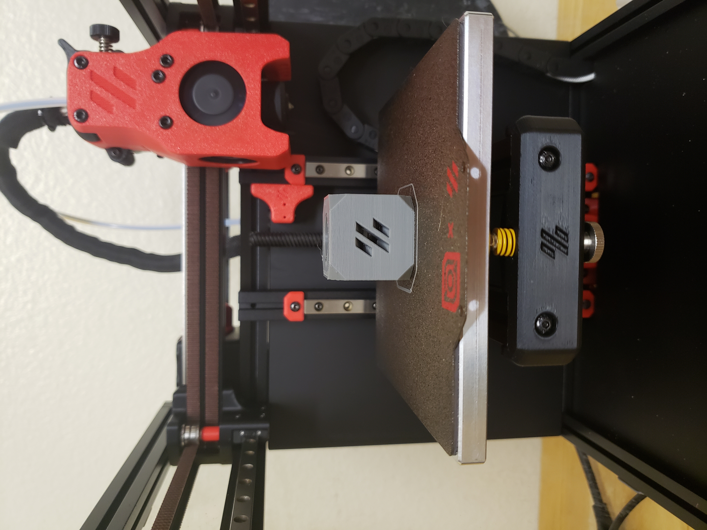
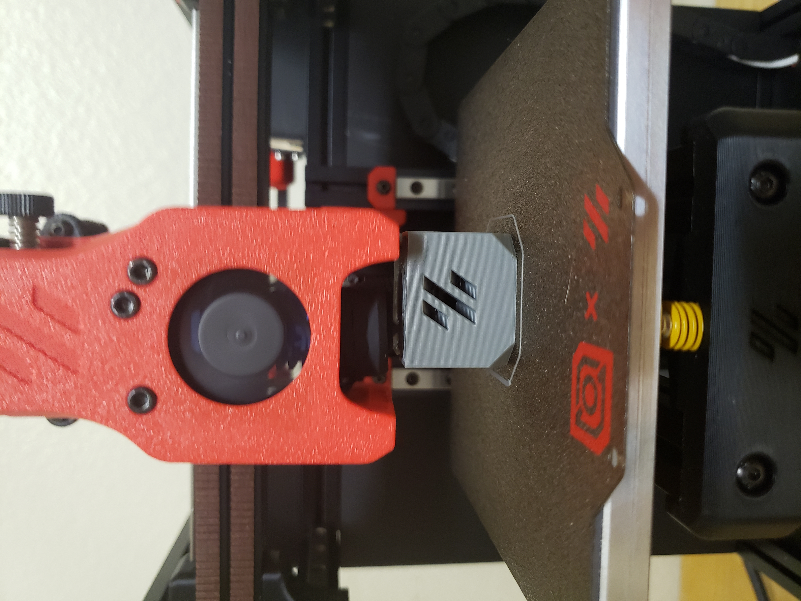
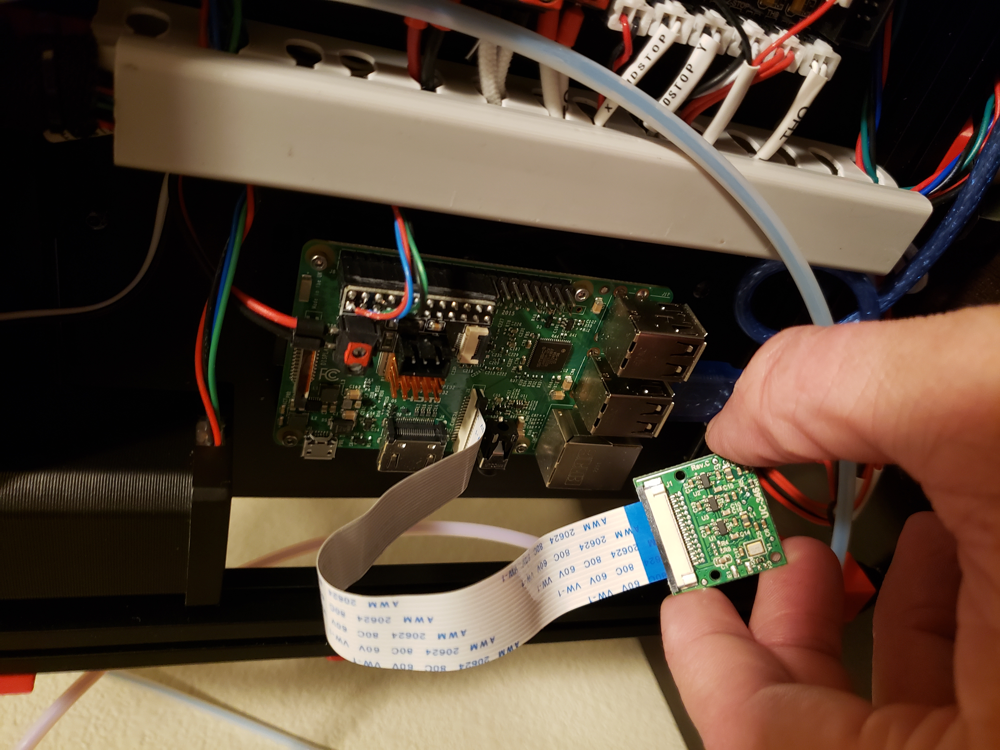
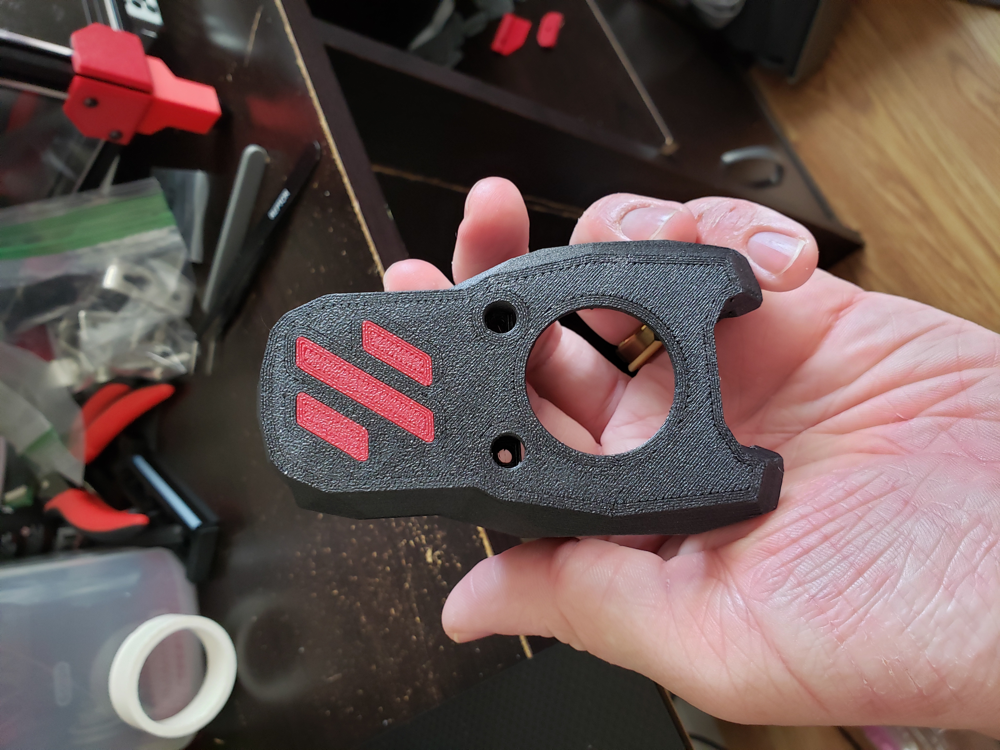
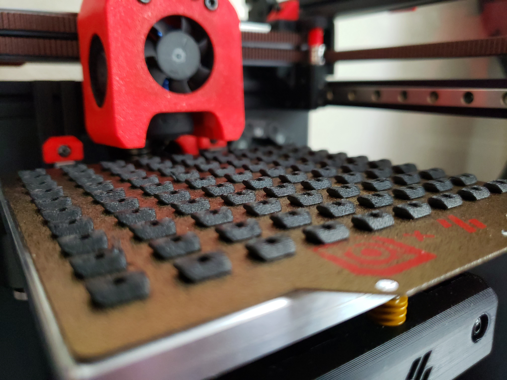
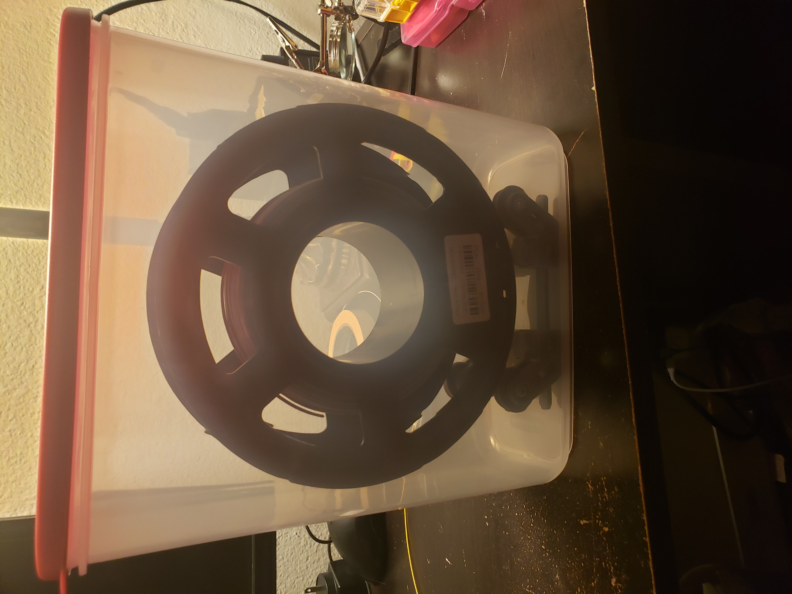

# Custom-Built 3D Printer
My 3D printer, built from parts, using the [Voron v0.1](https://vorondesign.com/voron0.1) design.

## Overview
Having grown to love the hobby of 3D printing from my experience with a much more basic [bed-slinger-style printer](https://www.creality.com/products/ender-3-3d-printer), I craved the experience and customizability of building my own printer. I came across the Voron community and was impressed by the quality of the many open-source designs that they had produced. Since I found that I mainly printed on a small scale the Voron v0 was an easy choice for me. The build process helped me to understand the intermeshing of mechanical and electrical systems brought to life by the [Klipper](https://www.klipper3d.org/) firmware and [Mainsail](https://docs.mainsail.xyz/) operating system. After much trial and error I was left with a fantastic printer! I use it as a tool to further my passion for CAD design and prototyping. I'm in the process of upgrading it to a [newer version](https://vorondesign.com/voron0.2) of the Voron v0 design.

## Component Highlights

| Electronics                                                         | Hardware                                                                        | Software/Firmware                                                                                                                             |
| ------------------------------------------------------------------- | ------------------------------------------------------------------------------- | --------------------------------------------------------------------------------------------------------------------------------------------- |
| - NEMA14 Stepper Motors   - Raspberry Pi 3b+   - RPi Camera | - MGN7H Linear Rails   - 1515 Aluminum Extrusions   - Printed ABS Parts | - [Mainsail OS](https://docs.mainsail.xyz/)   - [Klipper](https://www.klipper3d.org/)   - [WireGuard VPN](https://www.wireguard.com/) |

## Features / Capabilities
- Core XY printer design
- 120mm3 build volume
- Remote camera viewing through VPN
- Enclosed design
- Tungsten carbide nozzle

## What I Learned
- I understand better the interrelation between mechanical, electrical, and software design in creating a fully functional system.
- I learned how to follow documentation for all aspects of this project.
- I learned the basics of computer networking in having my laptop communicate with the Raspberry Pi.
- I learned basics of cyber security in connecting to my printer remotely through the WireGuard VPN.
- I've become more proficient in mechanical design and designing for manufacture in the realm of the FDM additive manufacturing process.
## Media

